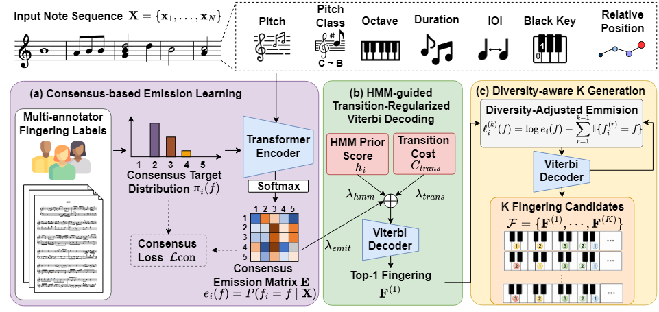

# FinCov

**FinCov: Multi-Expert Consensus Learning and Diversity-Aware Structured Decoding for Automatic Piano Fingering**

## Contribution

FinCov addresses the inherent ambiguity of automatic piano fingering, where
multiple experts may assign different yet valid fingerings to the same score.
Conventional approaches commonly use a single target sequence or treat expert
annotations independently, which may fail to preserve alternative valid finger
choices.

To address this issue, we formulate automatic piano fingering as a
multi-reference structured prediction problem. FinCov combines a
seven-dimensional Transition-Aware Piano (TAP) representation, multi-expert
consensus learning, and HMM-guided transition-regularized Viterbi decoding.
Expert disagreement is preserved as note-specific empirical finger-choice
distributions and integrated with sequence-level transition evidence during
global decoding.

Experiments on the PIG dataset demonstrate improved multi-reference annotation
agreement over the evaluated neural and HMM-based baselines.

## Architecture



## Data Preparation

Please download the PIG dataset from its official source.

Following the official PIG split, 120 pieces from the miscellaneous subset
are used for training, while 30 pieces from the Bach, Mozart, and Chopin
subsets are used for testing.

The dataset directory should be organized as follows:

```text
data/
└── pig/
    └── ...
```

## Training

Separate models are trained for the right hand (RH) and left hand (LH).

```bash
python train.py --pig_root data/pig --hand right --seed <seed>
python train.py --pig_root data/pig --hand left --seed <seed>
```


## Evaluation

Candidate 1 without diversity penalization is used for the main
single-sequence evaluation.

```bash
python evaluate.py --pig_root data/pig
```

The evaluation reports the four multi-reference PIG metrics:
$M_{\mathrm{gen}}$, $M_{\mathrm{high}}$, $M_{\mathrm{soft}}$, and
$M_{\mathrm{rec}}$.

## Experiment Results

The main results on the official PIG test set are:

| Hand | M_gen | M_high | M_soft | M_rec |
| --- | ---: | ---: | ---: | ---: |
| RH | 64.98 | 72.40 | 89.13 | 81.37 |
| LH | 70.81 | 77.45 | 89.37 | 83.22 |
| **Both** | **67.89** | **74.93** | **89.25** | **82.30** |

