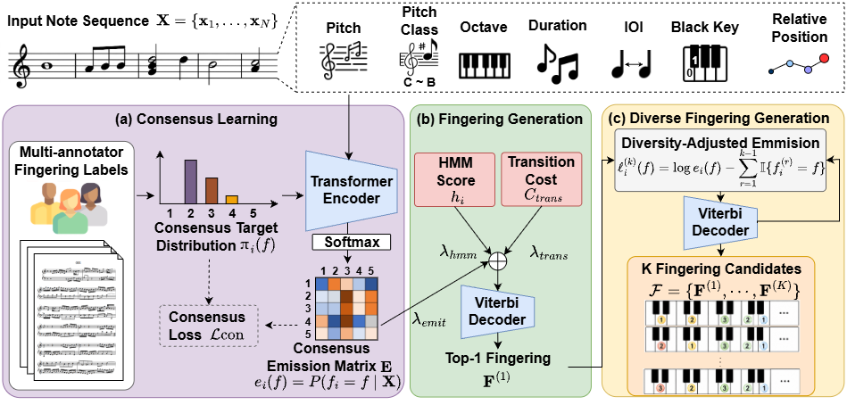
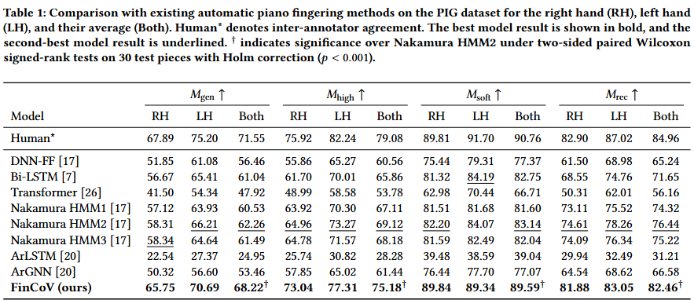

# FinCoV

**FinCoV: Multi-Expert Consensus Learning and Diversity-Aware Structured Decoding for Automatic Piano Fingering**

## Overview

Automatic piano fingering does not necessarily have a single correct solution,
as different experts may assign different fingerings to the same score.
FinCoV formulates automatic piano fingering as a **multi-reference structured
prediction problem** and addresses three aspects of piano fingering:

1. incorporating **different expert fingering choices**,
2. maintaining **sequence-level consistency**, and
3. generating **multiple distinct fingering alternatives**.

FinCoV consists of three modules:

- **Consensus Learning Module**  
  Represents multiple expert annotations as note-level finger distributions
  and learns consensus emission probabilities.

- **Fingering Generation Module**  
  Combines the learned consensus emissions with HMM transition statistics and
  transition regularization, and uses Viterbi decoding to generate a globally
  coherent fingering sequence.

- **Diverse Fingering Generation Module**  
  Repeatedly performs structured decoding with an accumulated overlap penalty
  to generate multiple distinct fingering alternatives.

## Architecture

<p align="center">
  
</p>

## Data Preparation

Please download the PIG dataset from its official source.

Following the official PIG split, 120 pieces from the miscellaneous subset
are used for training, while 30 pieces from the Bach, Mozart, and Chopin
subsets are used for testing.

The dataset directory should be organized as follows:

```text
data/
└── pig/
    └── ...
```

## Results

### PIG Benchmark

## Results

The main results on the official PIG benchmark are shown below.

<p align="center">
  
</p>

## Training

The Consensus Learning Module is trained separately for the right and left
hands.

### Right Hand

```bash
python train.py \
  --hand right \
  --pig_root data/pig \
  --device cuda \
  --out output/consensus_right/best.pt
```

### Left Hand

```bash
python train.py \
  --hand left \
  --pig_root data/pig \
  --device cuda \
  --out output/consensus_left/best.pt
```

## Evaluation

FinCoV uses the learned consensus emissions together with second-order HMM
transition statistics and transition regularization during structured decoding.

### Top-1 Fingering

For the right hand:

```bash
python evaluate.py \
  --hand right \
  --pig_root data/pig \
  --checkpoint output/consensus_right/best.pt \
  --device cuda \
  --top_k 1
```

For the left hand:

```bash
python evaluate.py \
  --hand left \
  --pig_root data/pig \
  --checkpoint output/consensus_left/best.pt \
  --device cuda \
  --top_k 1
```

